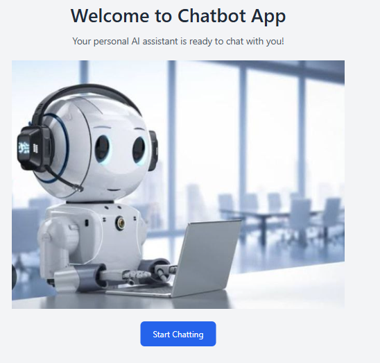
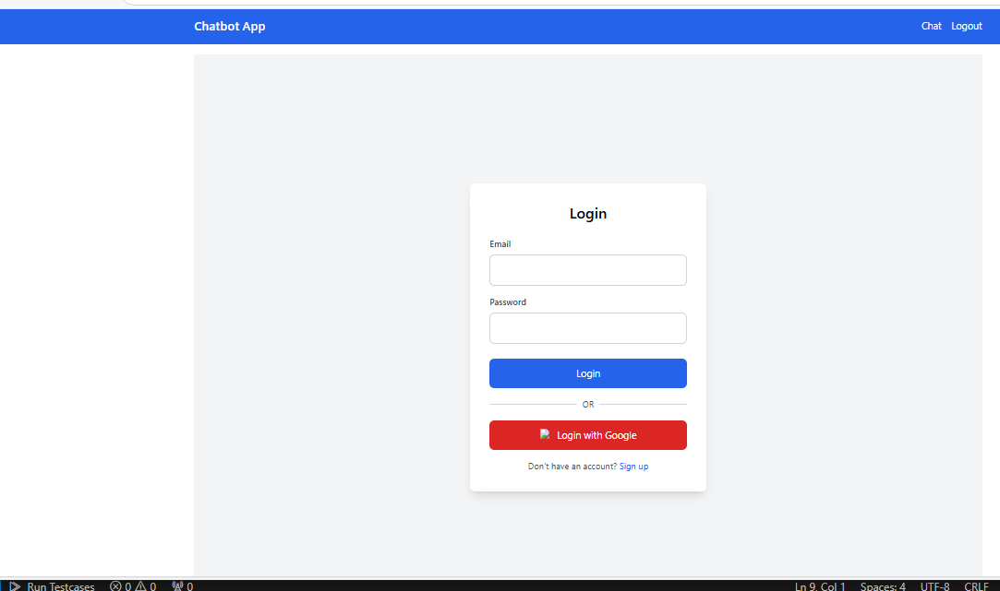
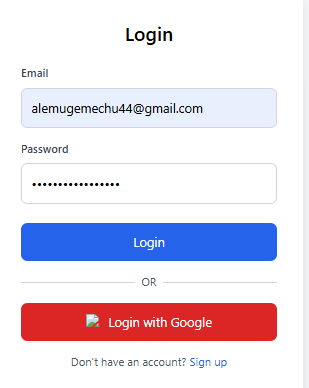
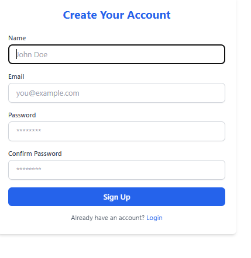
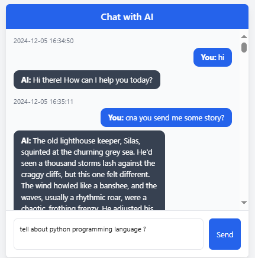
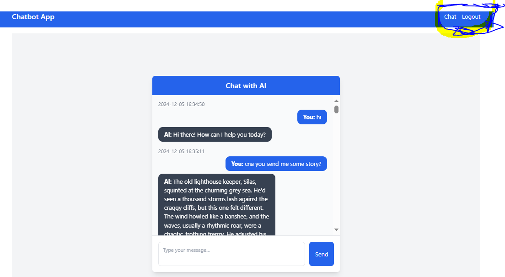

#Versatile AI Chatbot Application 🚀

An all-in-one chatbot solution powered by Google Gemini AI and Flask. This chatbot is designed to assist users in various domains, offering educational support, creative ideation, and answers to general queries with an intuitive and interactive user experience.

##Contents

Introduction

Key Features

Technology Stack

Screenshots

Planned Improvements

**Introduction**

This versatile AI chatbot leverages Google Gemini AI to provide intelligent, context-aware, and creative responses. It supports user authentication, real-time conversation tracking, and persistent chat history, all within a dynamic and responsive interface.

##**Key Features**

AI-Driven Conversations: Utilizes Google Gemini AI for generating intelligent and creative responses.

✅ **Multi-Domain Support:**

Answer FAQs and provide detailed explanations.

Assist with creative ideation and general queries.

✅ **User Authentication:**

Secure signup and login with password hashing.

✅ **Chat Management:**

it can Save histories.

✅ **Data Security:**

Secure storage of user data and chat history using Flask SQLAlchemy.

Session management with Flask-Login.

Enhanced User Experience:

#**Technology Stack**

✅ Backend: Flask, Flask-Login, Flask-SQLAlchemy

✅ Frontend: HTML, CSS, JavaScript

✅ AI Integration: Google Gemini AI

**Environment Management: **
 python-dotenv
#**API Endpoints**

✅ User Authentication

POST /auth/login: Authenticate and log in a user.

POST /auth/signup: Register a new user.

#**Chat Operations**
GET /chat: Render the chat interface.

POST /chat: Send a message and receive a response.

#**Screenshots**

**wel come page**

#**Login page**

#**signup**

#**Chat Page**

#**Logout**

#**Planned Improvements**

Third-party login support (e.g., Google).

New Chat Tab:"# chat_botai" 
"# chat_botai" 
"# chat_botAL" 
"# Bot" 
"# Chatbot-AI" 
